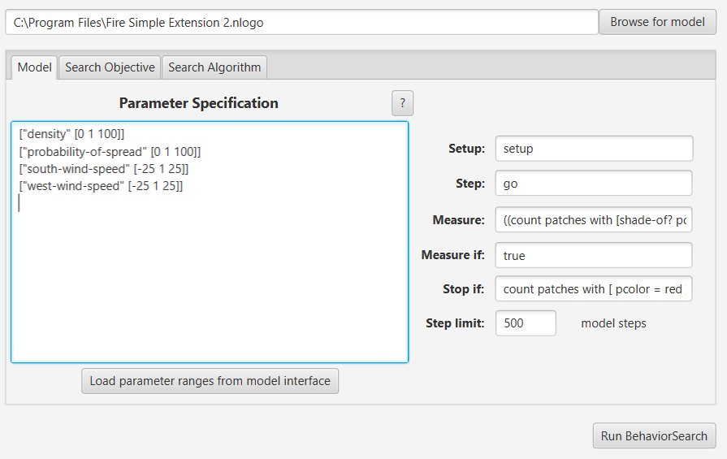
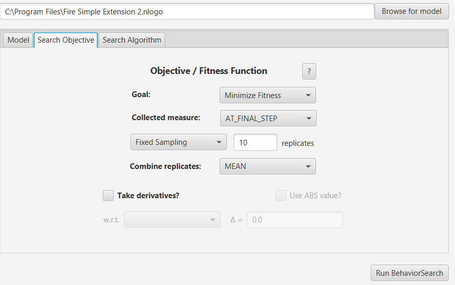
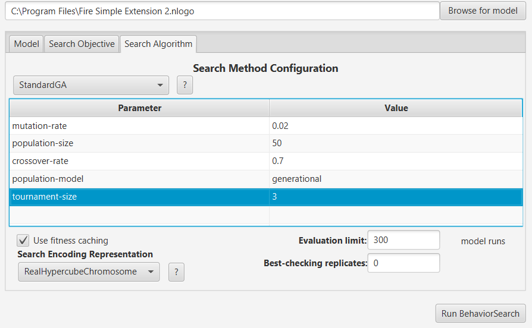
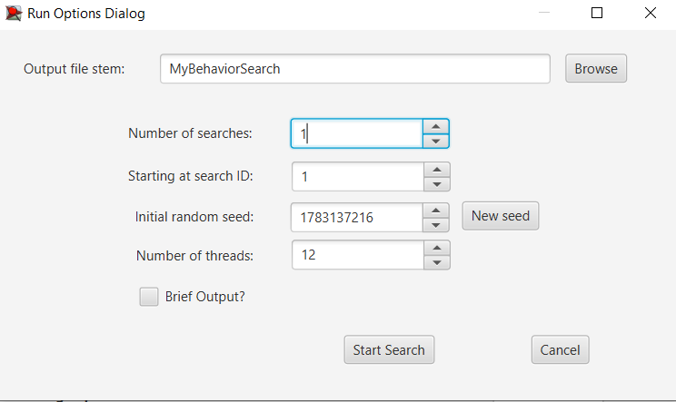
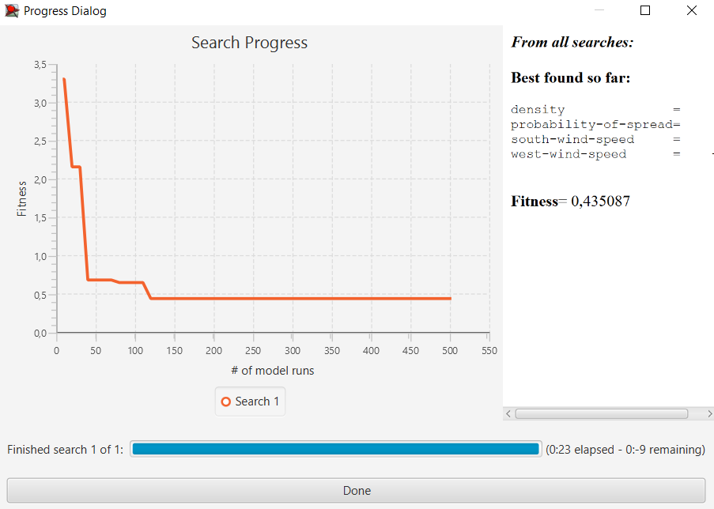
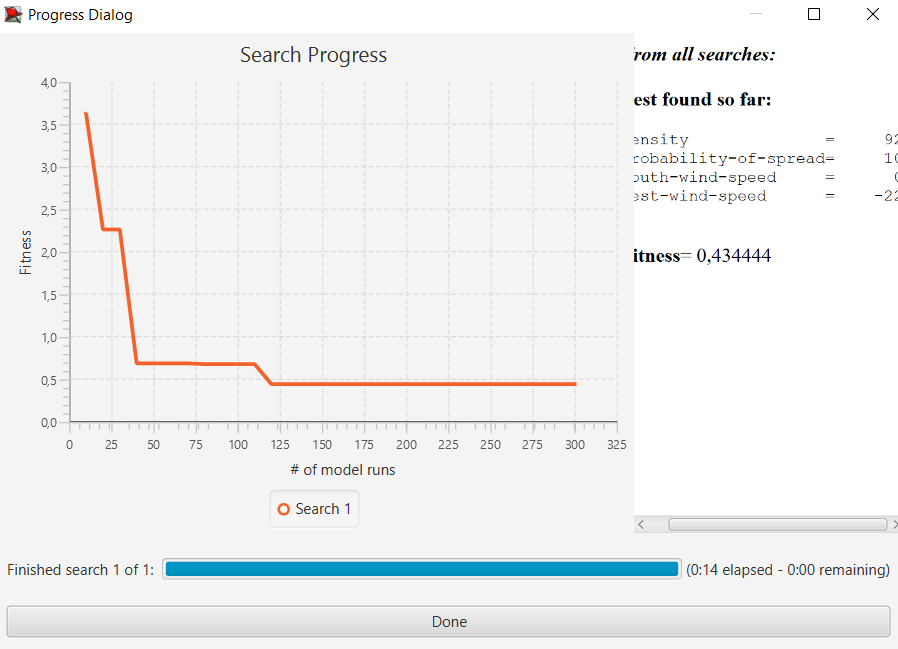

### Комп'ютерні системи імітаційного моделювання  
### Група СПм-23-5, **Холобок Владислав Іванович**  
### Лабораторна робота №**3**. Використання засобів обчислювального интелекту для оптимізації імітаційних моделей

---

### Варіант 5: Модель у середовищі NetLogo  
[Fire Simple Extension 2](http://www.netlogoweb.org/launch#http://www.netlogoweb.org/assets/modelslib/IABM%20Textbook/chapter%203/Fire%20Extensions/Fire%20Simple%20Extension%202.nlogo)  

---
### Вербальний опис моделі:

 - [Лабораторна робота №1](https://github.com/vHolobok/ksim_lab_1)

---
### Налаштування середовища BehaviorSearch:

**Обрана модель**:
<pre>
C:\Program Files\Fire Simple Extension 2
</pre>
**Параметри моделі** (вкладка Model):  
<pre>
["density" [0 1 100]]
["probability-of-spread" [0 1 100]]
["south-wind-speed" [-25 1 25]]
["west-wind-speed" [-25 1 25]]
</pre>

Використовувана **міра**:  :
Для фітнес-функції було обрано **відсоток спалених дерев**. Вираз для розрахунку взято з налаштувань монітору аналізованої імітаційної моделі в середовищі NetLogoта вказано у параметрі"**Measure**":
<pre>
((count patches with [shade-of? pcolor red]) / initial-trees)* 100
</pre>
Відсоток спалених дерев враховується лише на останньому такті симуляції тривалість якої  500 тактів, починаючи з 0 такту симуляції.  
Параметр зупинки за умовою ("**Stop if**"):
<pre>
count patches with [ pcolor = red ] = 0 ;;якщо патчів з червоним кольором нуль, то зупинитись 
</pre>

Загальний вигляд вкладки налаштувань параметрів моделі:

**Налаштування цільової функції** (вкладка Search Objective):  
Метою підбору параметрів імітаційної моделі є **мінімізація** відсотка спалених дерев – це вказано через параметр "**Goal**" зі значенням **Minimize Fitness**. Тобто необхідно визначити такі параметри налаштувань моделі, у яких якомога менше дерев згорає. Цікавить лише фінальне значення спалених дерев, після пожежі. Для цього у параметрі "**Collected measure**", що визначає спосіб обліку значень обраного показника, вказано **AT_FINAL_STERP**.  
Щоб уникнути викривлення результатів через випадкові значення, що використовуються в логіці самої імітаційної моделі, **кожна симуляція повторюється по 10 разів**, результуюче значення розраховується як **середнє арифметичне**. 
Загальний вигляд вкладки налаштувань цільової функції:

**Налаштування алгоритму пошуку** (вкладка Search Algorithm):  
Загальний вид вкладки налаштувань алгоритму пошуку: 

 

---
### Результати використання BehaviorSearch:
Діалогове вікно запуску пошуку 

Результат пошуку параметрів імітаційної моделі, використовуючи **генетичний алгоритм**:

Результат пошуку параметрів імітаційної моделі, використовуючи **випадковий пошук**:

 
